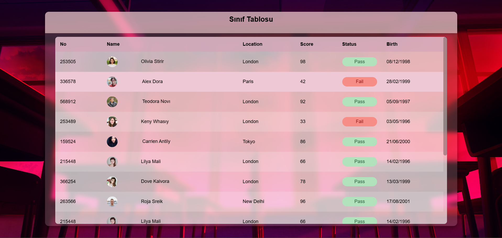

[Sınıf Tablosu --> Sayfaya Gitmek için Tıklayınız](http://127.0.0.1:5500/Week-1/exercise_1/sinif_tablosu.html)

  

### Tablo Oluşturma Süreci

Verilen görevde;

Tablo oluşturmak için sırasıyla aşağıdaki işlemler uygulanmıştır:

1. **6 sütun** ve **5 öğrenci** ile tabloyu oluşturuldu.
2. Her öğrenciye birer hücre daha eklenip **Doğum Tarihi** verisi eklendi.
3. Tablo genişliği **%100** yapıldı.
4. Hücrelere **kenarlık** eklendi, **padding** eklendi.
5. **Başlık satırlarının (th)** arka plan rengi ayarlandı.
6.**6 öğrenci daha eklendi**, toplamda **14 kişi** oldu.
7. Öğrencilerin sayısının fazla olmasından dolayı tabloya scrollbar eklendi.
8. Profil fotoğrafları eklendi.
9. Alınan puana göre Pass /Fail durumu gösterildi.
10. CSS kodları ile tablo daha efektif hale getirildi.

---